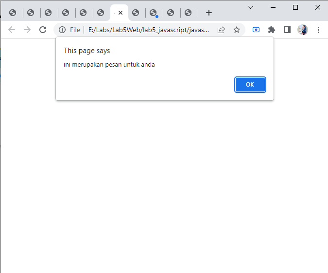
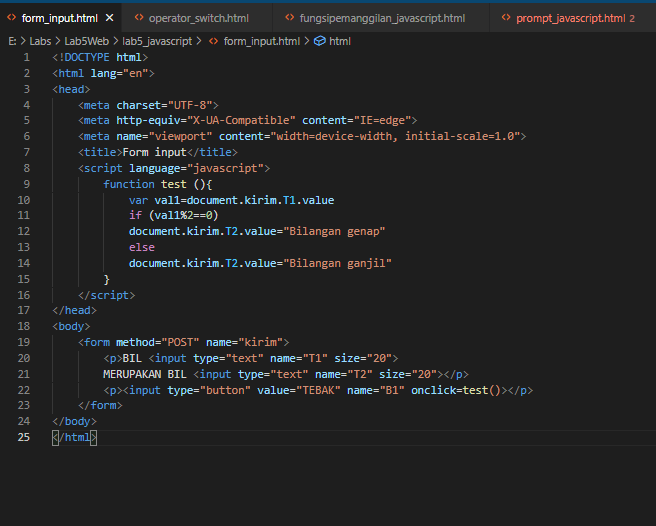
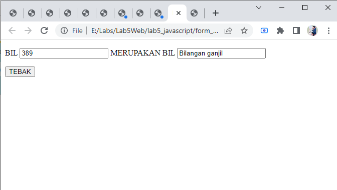
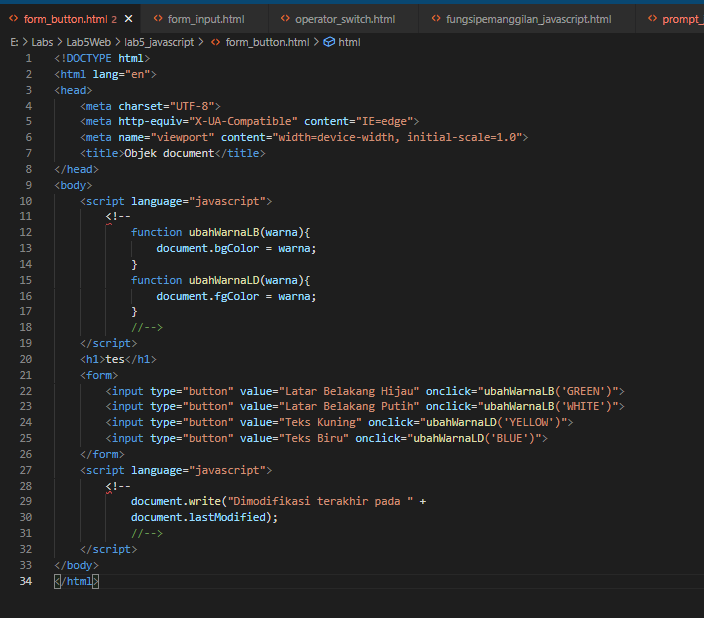
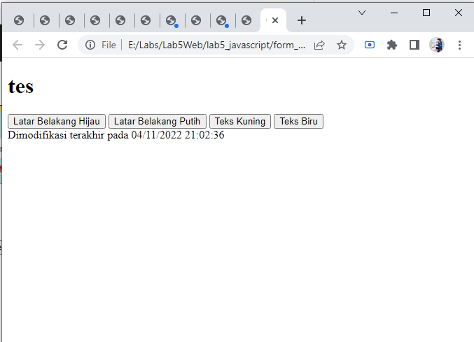
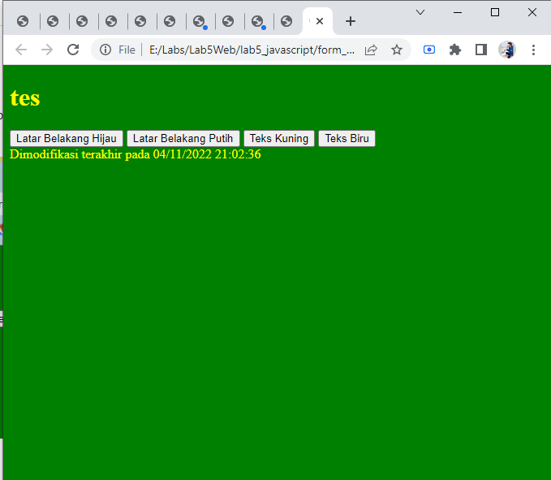
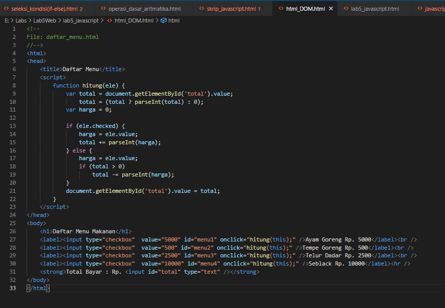
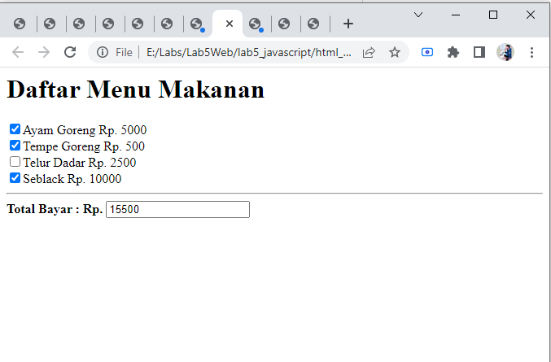

# Lab5Web
## Pengenalan JavaScript

Pengenalan JavaScript yang pertama adalah menulis JavaScript ke konsol browser menggunakan `<console.log()>`,
dan membuat file HTML terlebih dahulu, kemudian masukan codingan seperti ini :

Tampilan Website akan seperti ini, kemudian cek JavaScript nya dengan cara klik kanan -- Inspect element -- console,
kemudian akan tampil teks seperti yang tertera pada `<console.log()>`

## JavaScript Dasar
### JavaScript pemakaian Alert sebagai properti Windows

Membuat Alert saat membuka halaman tab baru pada Browser, Contoh codingan seperti gambar ini :

Tampilan di Browser akan seperti ini 

### Pemakaian Method dalam Objek

Membuat method seperti `<document.write>` pada object. Contohnya seperti ini :

Maka tampilan di Browser jadi seperti ini :

### Pemakaian Prompt

JavaScript untuk pemakaian Prompt adalah sebagai berikut :

Tampilan Browser nya seperti ini 

Kemudian masukan nama anda, sebagai contoh disini saya memasukkan nama saya sendiri, maka tampilan di Browser seperti ini 

### Fungsi dan Cara Pemanggilan

Membuat JavaScript fungsi dan cara pemanggilannya, contohnya seperti ini :

Maka tampilan di Browser akan seperti ini 

## Dasar Pemrograman di JavaScript
### Operasi Dasar Aritmatika

Membuat operasi dasar aritmatika lewat JavaScript. Contohnya seperti ini 

Tampilan di Browser seperti ini 

Kemudian klik pada `<arithmetic>` maka akan tampil operasi dasar aritmatika nya

### Seleksi Kondisi If-Else

Membuat logical if-else dengan JavaScript. Contohnya sederhana nya seperti ini :

Tampilan di Browser akan seperti ini 

Kemudian kita coba masukan angka dari 0-100, disini saya mencoba memasukkan angka 80, maka yang akan muncul 
tampilan lulus, sesuai dengan if pada codingan diatas.

### Operator Switch

Membuat operator Switch untuk seleksi kondisi. Contohnya seperti ini :

Tampilan di Browser akan jadi seperti ini 

Disini saya mencoba memasukkan angka 5, maka tampilan yang akan muncul yaitu "bilangan lima" sesuai dengan codingan diatas

## Pembuatan Form
### Form Input

Membuat form input menggunakan JavaScript. Contoh sederhana nya seperti ini

Kita coba buka di Browser, tampilannya akan seperti ini 

### Form Button

Membuat form button menggunakan JavaScript. Contoh sederhananya seperti ini 

Tampilan di Browser akan jadi seperti ini 

Kemudian coba click pada button nya, disini saya mencoba memakai latar belakang hijau dan teks kuning.

## HTML DOM
### Checkbox Perhitungann Otomatis

Membuat checkbox dengan perhitungan otomatis, dibawah ini contoh codingan daftar menu sederhana beserta hitungan harganya.
Seperti gambar dibawah ini 

Tampilan di Browser akan seperti ini, saat kita menceklis pilihan tersebut maka jumlah nominal akan otomatis terakumulasi

## Tugas 
